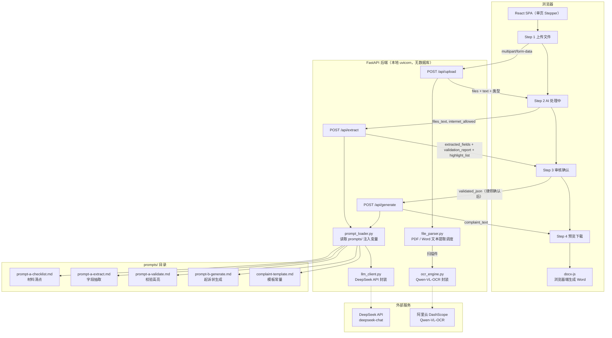
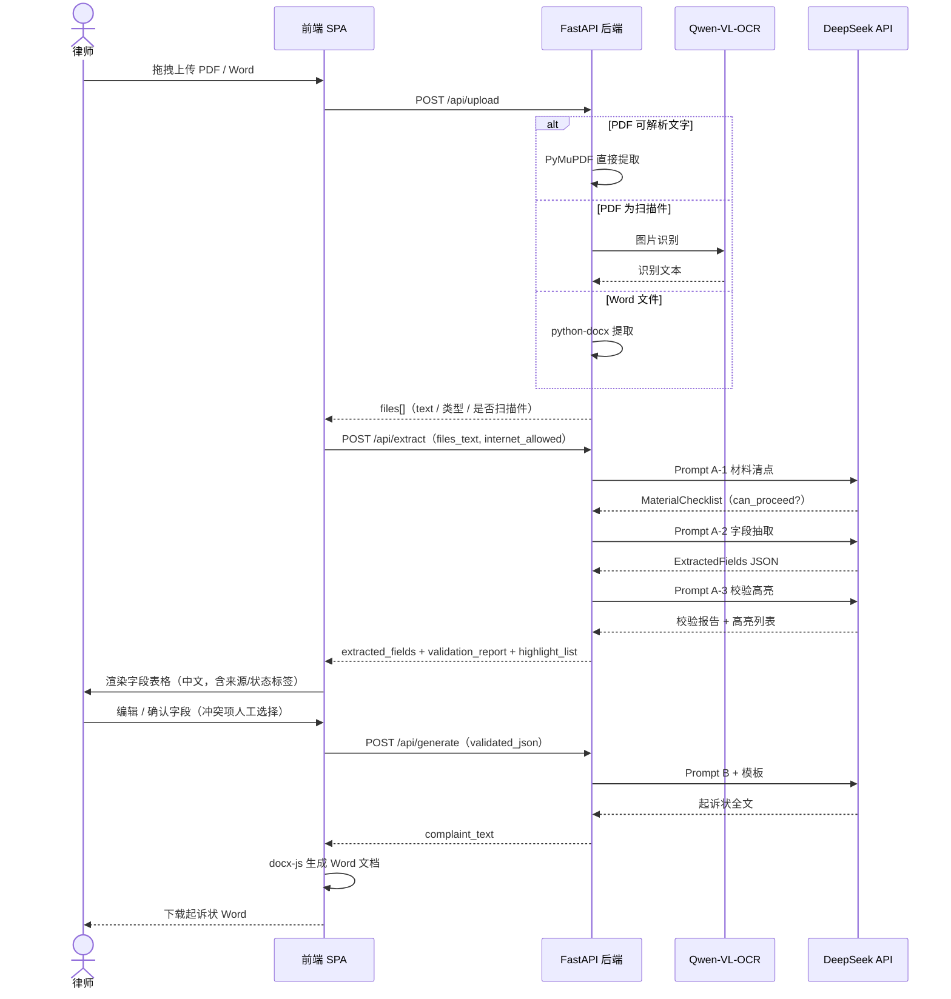

# 起诉状助手 · 安装合同纠纷起诉状自动化系统（v1）

面向律师团队的 Web 应用：上传案件材料（审批表、合同、验收报告等），由 AI 完成信息抽取与交叉校验，律师审核确认后一键生成民事起诉状 Word 文档。

> v1 定位：验证 AI 抽取准确率与律师使用体验。无数据库、无用户认证，案件不持久化，仅本地运行。

---

## 核心原则

- **AI 不做最终判断**——AI 只负责抽取和校验，律师负责确认与修改
- **出处可追溯**——每个字段值都标注来源文件和位置
- **宁缺勿造**——无法确定的字段标为缺失，绝不编造

---

## 技术栈

| | |
|---|---|
| 前端 | React 19 + Vite + TypeScript（strict）+ Tailwind CSS + shadcn/ui + react-hook-form/zod + docx-js |
| 后端 | FastAPI（Python 3.13）+ PyMuPDF（PDF）+ python-docx（Word） |
| OCR | Qwen-VL-OCR（阿里云 DashScope 云端 API），扫描件识别 |
| LLM | DeepSeek API（`deepseek-chat`，通过 OpenAI SDK 调用） |

---

## 架构图



---

## 数据流（三步处理）



---

## 项目结构

```
legal-doc-gen/
├── CLAUDE.md                        # AI 编码助手项目指令（详细规范）
├── prompts/                         # LLM Prompt 模板
│   ├── prompt-a-checklist.md
│   ├── prompt-a-extract.md
│   ├── prompt-a-validate.md
│   ├── prompt-b-generate.md
│   └── complaint-template.md
│
├── frontend/                        # React 前端
│   └── src/
│       ├── components/
│       │   ├── ui/                  # shadcn/ui
│       │   ├── layout/              # Header, Stepper
│       │   ├── upload/              # Step 1
│       │   ├── processing/          # Step 2
│       │   ├── review/              # Step 3（核心）
│       │   └── preview/             # Step 4
│       ├── hooks/useComplaintFlow.ts
│       └── lib/{api,doc-generator,field-map,types}.ts
│
└── backend/                         # Python FastAPI 后端
    └── app/
        ├── routers/{files,extract,generate}.py
        ├── services/{file_parser,ocr_engine,llm_client,prompt_loader}.py
        └── config.py
```

---

## 本地开发

```bash
# 1. 启动后端
cd backend
pip install -r requirements.txt
cp .env.example .env       # 填入 DEEPSEEK_API_KEY 和 DASHSCOPE_API_KEY
uvicorn app.main:app --reload --port 8000

# 2. 启动前端
cd frontend
pnpm install
pnpm dev                   # http://localhost:5173，/api/* 代理转发到 :8000
```

---

## v1 不包含

数据库持久化、用户认证、批量案件处理、Docker 化部署等——详见 [CLAUDE.md](./CLAUDE.md#v1-不包含后续迭代预留)。
