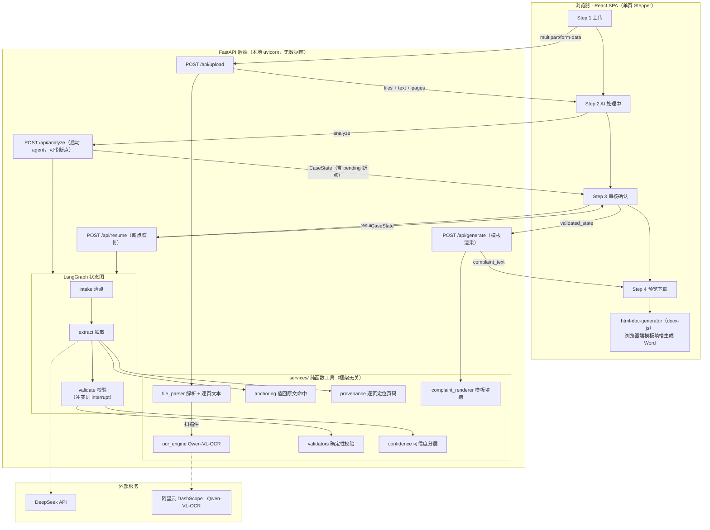
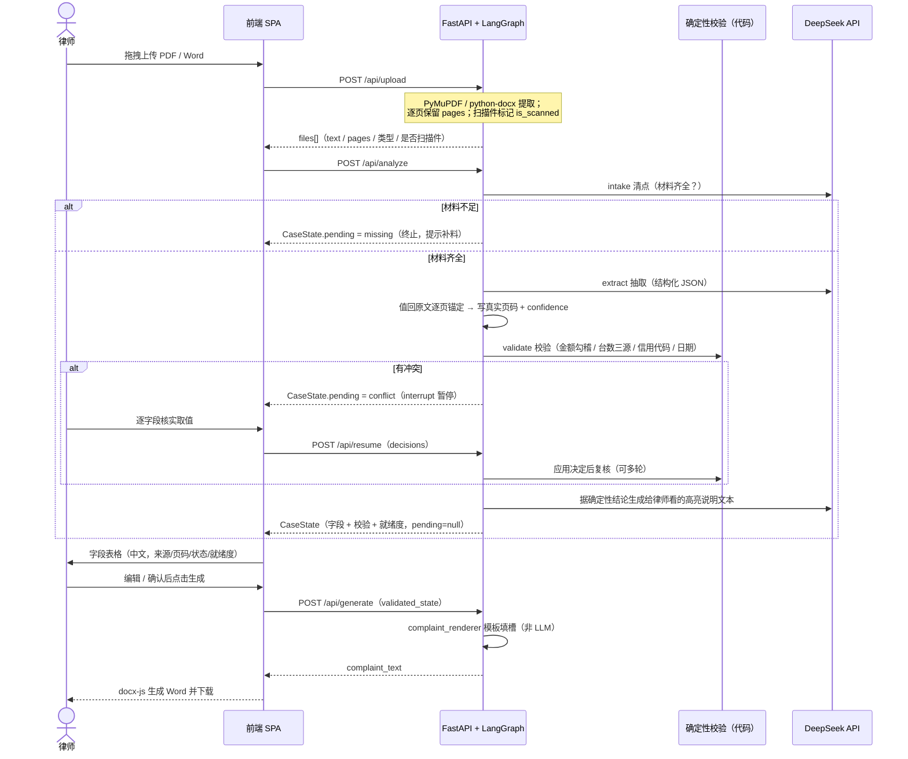

# 起诉状助手 · 安装合同纠纷起诉状自动化系统（v2）

**中文** | [English](./README.en.md)

面向律师团队的 Web 应用：上传案件材料（审批表、安装合同、验收/监检报告等），由 agent 自动完成材料清点、字段抽取、交叉校验，律师审核确认后一键生成民事起诉状 Word 文档。

> **v1 → v2**：v1 是固定流水线（`upload → 清点 → 抽取 → 校验 → 生成`，控制流写死）。v2 将核心处理改为 **agentic**——由带工具的 LangGraph agent 驱动控制流，按需读取材料、用确定性代码自校验、在关键分歧点暂停问律师（human-in-the-loop）。
>
> v2 定位：验证 AI 抽取准确率与律师使用体验。无数据库、无用户认证，案件不持久化（agent 状态仅在单次会话内存活），仅本地运行。

---

## 核心原则

- **AI 不做最终判断**——agent 只负责抽取、校验、提议，律师负责确认与修改；关键分歧点暂停问律师
- **校验用代码，不用 LLM**——金额勾稽、台数三源比对、格式校验一律由确定性 Python 代码完成，LLM 只负责“抽出数字”
- **出处可追溯**——每个字段值标注来源文件 + **已验证的真实页码**（逐页锚定得出，非 LLM 自述）
- **宁缺勿造**——无法确定的字段标为缺失，绝不编造；回原文比对未命中则降置信、标“待核实”
- **模板渲染，不自由生成**——起诉状由结构化字段 + 模板确定性填槽，LLM 不写全文

---

## 技术栈

| | |
|---|---|
| 前端 | React 19 + Vite + TypeScript（strict）+ Tailwind CSS + shadcn/ui + react-hook-form/zod + docx-js |
| 后端 | FastAPI（Python 3.10+）+ PyMuPDF（PDF）+ python-docx（Word） |
| Agent 编排 | LangGraph（状态图 + `interrupt` 断点 + in-memory checkpoint；仅用图与检查点，不引入 LangChain 本体） |
| OCR | Qwen-VL-OCR（阿里云 DashScope 云端 API），扫描件识别 |
| LLM | DeepSeek API（`deepseek-v4-flash`，通过 OpenAI SDK 调用，启用结构化输出） |

---

## 材料形态与来源可靠性分级

一个典型案件通常含三类材料，形态与可靠性差异很大，agent 区别对待：

| 材料 | 形态 | 可靠性 | agent 策略 |
|---|---|---|---|
| **审批表** | 可解析文本、键值表单 | ⭐⭐⭐ 最高 | **主数据源**：被告名称/地址、合同号、台数、金额等绝大多数字段直取 |
| **验收/监检报告** | 可解析文本 + 盖章图 | ⭐⭐ 中高 | **交叉校验源**：信用代码、安装地点、验收日期、台数（报告份数） |
| **安装合同** | 常为纯扫描件（需 OCR） | ⭐ 有噪声 | **条款文本源**：付款/违约利率/争议解决条款。按需只读相关页 |

---

## 系统架构



---

## 数据流（agent 会话 + human-in-the-loop）



---

## 确定性校验与可信度分层

- **校验（代码，非 LLM）**：`validators.py` 做金额勾稽（`总额 == 已付 + 未付`）、台数三源一致（签约/合同/验收）、信用代码 18 位校验位、日期合法性。冲突结论是审核页“冲突”态的唯一权威来源。
- **可信度分层**：硬信号定状态（`FieldStatus`：正常/缺失/冲突/待核实），软信号给 `confidence`（0–100，仅供 UI 排序/默认展开）。`confidence = 来源通道×40 + 锚定质量×30 + 自一致×20 + 模型自评×10`。
- **出处可追溯**：`anchoring.py` 把抽取值拿回原文逐页精确比对，`provenance.py` 据命中页给出**已验证的真实页码**；未命中不伪造页码，只降置信标“待核实”。

---

## 项目结构

```
legal-doc-gen/
├── CLAUDE.md                        # AI 编码助手项目指令（详细规范）
├── README.md / README.en.md         # 本文件（中/英）
├── prompts/                         # LLM Prompt 模板
│   ├── prompt-a-checklist.md        # 材料清点
│   ├── prompt-a-extract.md          # 字段抽取（结构化）
│   ├── prompt-a-validate.md         # 仅生成高亮说明文本（不做一致性判断）
│   └── complaint-template.md        # 起诉状模板（占位符）
│
├── frontend/                        # React 前端
│   └── src/
│       ├── components/{upload,processing,review,preview,layout,ui}/
│       ├── hooks/useComplaintFlow.ts        # analyze/resume 流程状态
│       └── lib/{api,buildReviewFields,field-map,html-doc-generator,types}.ts
│
└── backend/                         # Python FastAPI 后端
    └── app/
        ├── main.py
        ├── routers/{files,analyze,resume,generate,extract}.py   # extract 为 v1 遗留
        ├── agent/{graph,state,nodes}.py                          # LangGraph 状态图
        ├── services/                                             # 框架无关纯函数工具
        │   ├── file_parser.py  ocr_engine.py  llm_client.py  prompt_loader.py
        │   ├── validators.py   confidence.py  anchoring.py   provenance.py
        │   ├── extraction.py   complaint_renderer.py
        │   └── llm_progress.py upload_progress.py
        └── config.py
```

---

## 本地开发

```bash
# 1. 启动后端
cd backend
pip install -r requirements.txt
cp .env.example .env       # 填入 DEEPSEEK_API_KEY 和 DASHSCOPE_API_KEY
uvicorn app.main:app --reload --port 8000

# 2. 启动前端
cd frontend
pnpm install
pnpm dev                   # http://localhost:5173，/api/* 代理转发到 :8000
```

后端测试：`cd backend && python -m pytest`

---

## 迁移进度（v1 流水线 → v2 agentic）

| 步骤 | 内容 | 状态 |
|---|---|---|
| 1–2 | 工具层（validators / confidence / anchoring）+ 单测 | ✅ |
| 3 | 交叉校验移出 LLM，改确定性代码 | ✅ |
| 4 | 起诉状改模板填槽渲染（去 LLM 自由生成） | ✅ |
| 5 | agent 编排（LangGraph + interrupt，前后端） | ✅ |
| 6a | 字段出处可追溯（逐页锚定得真实页码） | ✅ |
| 6b | 按需 OCR（扫描合同按需 `ocr_page` + `search_in_docs`） | ⏳ |
| 7 | 联网企业信息查询（按信用代码补法人全称） | ⏳ |

---

## v2 不包含（后续迭代预留）

数据库持久化、用户认证、批量案件处理、Docker 化部署、向量检索、LangChain 本体等——详见 [CLAUDE.md](./CLAUDE.md)。
