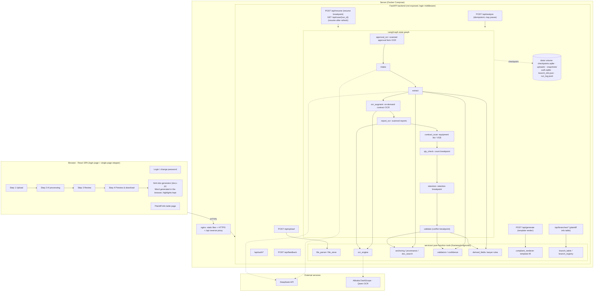
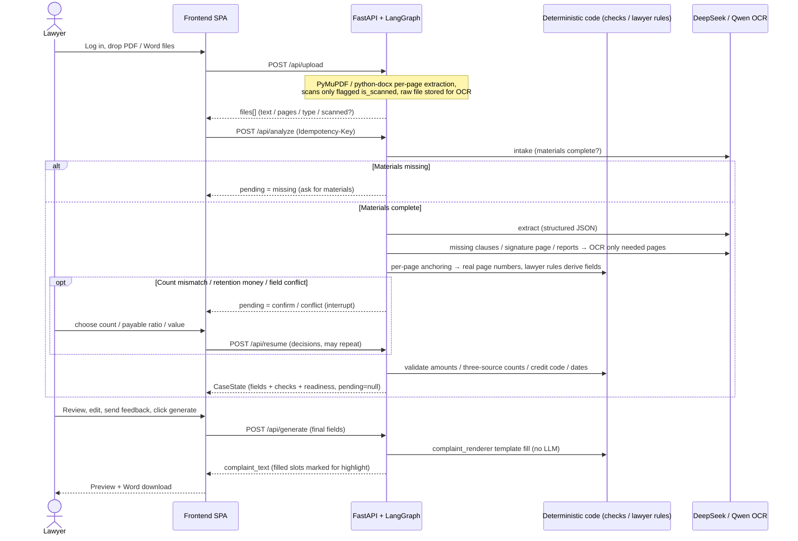

# Complaint Assistant · Elevator Installation-Contract Dispute Automation (v2)

**English** | [中文](./README.zh-CN.md)

A web app for legal teams. Lawyers upload case materials: approval forms, installation or sales contracts, and elevator supervision inspection reports. An agent then does several things:

- checks the materials in, extracts fields, and cross-validates them;
- applies the lawyer-confirmed drafting rules to derive the plaintiff, elevator counts, penalties and the competent court.

After the lawyer reviews and confirms, the app generates a civil complaint as a Word document in one click, with the filled-in text highlighted in yellow for a final check. If the contract specifies arbitration, it generates an arbitration application instead.

> **v1 → v2**: v1 was a fixed pipeline (`upload → checklist → extract → validate → generate`) with hard-wired control flow. v2 makes the core **agentic**. A tool-equipped LangGraph agent drives the control flow, OCRs only the scanned pages it needs, self-checks with deterministic code, and pauses at key disagreements to ask the lawyer (human-in-the-loop).
>
> **Current status**: deployed for lawyer trials (UAT), to validate AI extraction accuracy and the lawyer experience. The site has a Chinese login page, admin-created accounts and HTTPS. Case state is stored in a local SQLite database, so review can resume after a restart, and it is purged automatically after 7 days. Separately, **production case snapshots** (the uploaded originals, recorded model responses and the lawyer's final fields) are kept for 180 days, with the law firm's consent, and are used only for evaluation and extraction-quality statistics.

## At a glance

### Architecture

- **Three layers.** A React single-page app (upload → processing → review → preview) talks to a FastAPI backend. The backend runs a LangGraph agent, and the agent calls framework-agnostic tools in `backend/app/services/`.
- **Agent graph.** One case runs through a fixed set of nodes:
  1. `approval_ocr`: OCR a scanned approval form.
  2. `intake`: check which materials were uploaded. This is plain code.
  3. `extract`: the LLM extracts fields as structured output.
  4. `ocr_augment`, `report_ocr`, `contract_scan`: OCR scanned contracts and reports page by page, stopping once the needed clauses are found.
  5. `qty_check`, `retention`, `validate`: lawyer breakpoints.

  Each breakpoint is a LangGraph `interrupt`. The case state is checkpointed to SQLite, so the lawyer can answer, refresh or come back later, and the agent resumes from the same point.
- **Division of labour.** The LLM only reads values and clause text out of the materials. Deterministic Python code does everything else:
  - matching each value back to its source page;
  - reconciling amounts and elevator counts;
  - applying the lawyer-confirmed drafting rules;
  - filling the complaint template.

  The frontend turns the filled template into a Word file.
- **External services.** DeepSeek is the LLM, with Qwen as the fallback. Qwen multimodal via DashScope does the OCR. API keys stay on the server.

Details: [System architecture](#system-architecture) and [Data flow](#data-flow-agent-session--human-in-the-loop).

### Evaluation

- **Real cases.** `backend/scripts/eval_cases.py` runs the full pipeline, without the browser, on real cases whose complaints a lawyer has already written. It scores the result field by field. The latest run covered 14 real cases and got 311 of 312 scored fields right (over 99%), with no silent errors. Real cases stay on the server and are never committed.
- **Synthetic cases in CI.** Every pull request replays twelve fully synthetic cases in [`backend/eval_fixtures/`](./backend/eval_fixtures/README.md), using recorded OCR and LLM responses, so it needs no network and costs nothing. The job fails if any field gets worse against the committed baseline, or if a change sends a request that was never recorded.
- **Beyond accuracy.** Reports also count:
  - fields taken from the wrong source file;
  - *silent errors*: wrong values that the review page shows as normal.

  Each wrong or missing field is also attributed to a cause, using only the recorded OCR text:
  - extraction error;
  - suspected OCR misread;
  - page never OCR'd;
  - value not from OCR;
  - rule-derived wording.

  The cause shows whether to work on OCR or on extraction next.
- **From production back to eval.** Production keeps a 180-day snapshot of each case. A case the lawyer exported can be turned into an eval case and replayed for free, with the lawyer's final fields as the answer key. The snapshots also feed an extraction-quality report: which fields lawyers change, and silent errors.
- **Judge and tracing.** Rule-built sentences can be scored by an allow-listed LLM judge (warn-only in CI, being calibrated). `--langfuse` sends each case's calls to a self-hosted Langfuse for inspection.

Details: [Evaluation](#evaluation).

---

## Core principles

- **AI never makes the final call.** The agent only extracts, validates and proposes; the lawyer confirms and edits. It pauses to ask at key disagreements:
  - conflicting fields;
  - mismatched elevator counts;
  - the retention-money ratio.

  Missing materials are flagged on the upload page instead: the lawyer can add files or choose to continue with what was uploaded.
- **Validation is code, not LLM.** Deterministic Python handles amount reconciliation, the three-source quantity comparison, format checks, and the calculations in the lawyer rules (penalty amount, start date, court name, etc.). The LLM only pulls out the numbers and the clause text.
- **Traceable provenance.** Every field value is tagged with its source file and a **verified page number** found by per-page anchoring, never one the LLM reports itself.
- **A gap beats a fabrication.** Uncertain fields are marked missing and never invented. A value that does not anchor back to the source is flagged "to verify", both on the review page and in the complaint.
- **Template rendering, not free generation.** The complaint is filled deterministically from structured fields into the lawyers' template. The LLM never writes the full text.

---

## Features

| Feature | Details |
|---|---|
| Material parsing | Text PDFs, Word files and scanned PDFs (≤ 20 MB each, ≤ 95 MB per upload). Scans are never OCR'd whole: the agent reads only the pages it needs (payment / breach / dispute clauses, signature page, equipment list, acceptance reports) and stops once it finds them, capped at 50 pages of scanned contracts and 30 pages of scanned acceptance reports per case. A scan whose file name gives no type has only its first page OCR'd to read the title. |
| Material confirmation | After upload, each file shows its detected type (approval form / contract / supplementary agreement / acceptance report / strategic or framework contract). The lawyer can correct it from a dropdown, and the missing-materials check is recomputed. |
| Extraction & anchoring | Structured fields are read straight from the approval form, and contract clauses are kept verbatim. Each value is matched back to the source page by page; values with no match are flagged "to verify". |
| Cross-validation | Amount reconciliation (total = paid + unpaid), elevator counts across signing / contract / acceptance, credit-code check digit, dates. |
| Lawyer drafting rules | Several rounds of lawyer-confirmed rule sheets, implemented as code in `services/derived_fields.py` and `services/payment_nodes.py`. They cover:<br>• plaintiff naming (HQ + branch, or an independent subsidiary)<br>• sales vs. installation wording<br>• elevator-count basis (including VGE home elevators)<br>• citing the payment milestones the debt falls under (matched by the cumulative ratio of paid + unpaid)<br>• supplementary agreements and strategic / framework contracts (clauses only)<br>• penalty vs. late-payment interest (rate-based, lump-sum, fixed daily amount, caps)<br>• paid / unpaid ratios<br>• competent court and jurisdiction sentence<br>• switching to an arbitration application |
| Lawyer breakpoints | Pauses on field conflicts, count mismatches, and contracts with retention money (the lawyer picks "paid up to X% of the contract price"). It resumes once the lawyer decides. |
| Review page | A Chinese field table with status, source and page, grouped into parties / contract & amounts / payment & breach clauses / jurisdiction & document, with a "needs attention only" filter. Every field is editable, and each field has a button for submitting feedback on it. Edits survive going back from the preview; the browser asks before a refresh, and after one the lawyer can resume the previous case. |
| Complaint export | The preview shows how many blanks still need filling. The Word export keeps the yellow highlights for a final check. |
| Plaintiff info table | A firm-wide table of plaintiff credit codes, legal representatives and addresses. Anyone can view or download it as Excel; uploading a new version or restoring an old one needs the admin token. |
| Login | Accounts are created by an admin on the server (there is no sign-up). Sessions last 7 days, lawyers can change their own password, and repeated wrong passwords lock the login. |
| Operations | The run log records field keys, timings, tokens and account names, never case content. On top of it:<br>• usage per account, and a list of lawyer feedback<br>• cost per case / node / model (from configured unit prices), fixed error categories, how long lawyers wait at breakpoints and how often they abandon<br>• a daily summary written on the server, with alerts when thresholds are crossed (failed analyses, OCR failure rate, model fallbacks, paid-key use, key connectivity)<br>• browser errors and API 5xx reported from the frontend (error type and step only, never the message text)<br>GitHub Actions deploys after approval. Health checks are split into liveness (`/healthz`) and readiness (`/readyz`: database read/write, free disk, keys configured), and a deploy that is not ready rolls back automatically. |
| Production case snapshots | Each case keeps a snapshot: the uploaded originals, the recorded LLM / OCR responses, each breakpoint's question and the lawyer's answer, the fields and validation results handed to the lawyer, and the fields the lawyer finally confirmed. Kept for 180 days, directories 0700 and files 0600; a failed snapshot write never affects the lawyer's flow. Uses:<br>• export as eval cases and replay them strictly on a developer laptop at no cost, with the lawyer's final version as the expected answer<br>• extraction-quality statistics straight from the snapshots: which fields lawyers change most, silent errors, whether confidence tracks the edit rate, and whether a breakpoint always gets the same answer |

---

## Tech stack

| | |
|---|---|
| Frontend | React 19 + Vite + TypeScript (strict) + Tailwind CSS + shadcn/ui + react-hook-form/zod + docx-js |
| Backend | FastAPI (Python 3.10+) + PyMuPDF (PDF) + python-docx (Word) |
| Agent orchestration | LangGraph (state graph + `interrupt` breakpoints + SQLite checkpoint; graph and checkpoints only, no full LangChain) |
| OCR | Qwen multimodal via Alibaba Cloud DashScope (international), default `qwen3.8-flash`, with an optional paid backup key |
| LLM | DeepSeek API (`deepseek-flash`, served by V4.1-Flash-1017 since 2026-10-17; via the OpenAI SDK with structured output) |
| Eval tracing | Self-hosted Langfuse on a developer laptop, for development and eval only; production does not use it |
| Deployment | Docker Compose (backend + nginx), Let's Encrypt HTTPS, GitHub Actions auto-deploy after approval |

---

## Material types and source reliability tiers

A typical case has three material types that differ greatly in form and reliability, so the agent treats them differently:

| Material | Form | Reliability | Agent strategy |
|---|---|---|---|
| **Approval form** | Parseable text, key–value form | ⭐⭐⭐ highest | **Primary source**: contract type, contracting branch, defendant name, contract no., counts, amounts and contacts are read directly. The defendant's address and legal representative come from the business registry, not from this form. |
| **Acceptance / inspection reports** | Parseable text + stamp image; often phone-photo scans | ⭐⭐ medium-high | **Cross-check source**: credit code, installation site, approval date (latest batch), elevator count (one per report front page). Scanned reports are OCR'd on demand. |
| **Installation / sales contract** | Often a pure scan (needs OCR) | ⭐ noisy | **Clause source**: payment, breach, retention-money and dispute clauses, plus the signature page and equipment list. Only relevant pages are read, and reading stops once the clause is found. |

---

## System architecture


```mermaid
flowchart TB
    subgraph Browser["Browser · React SPA (login page + single-page stepper)"]
        LG["Login / change password"]
        S1["Step 1 Upload"] --> S2["Step 2 AI processing"] --> S3["Step 3 Review"] --> S4["Step 4 Preview & download"]
        S4 --> DOCX["html-doc-generator (docx-js)<br/>Word generated in the browser, highlights kept"]
        BR["Plaintiff info table page"]
    end

    subgraph Server["Server (Docker Compose)"]
        NG["nginx: static files + HTTPS + /api reverse proxy"]

        subgraph Backend["FastAPI backend (not exposed, login middleware)"]
            RAU["/api/auth/*"]
            RU["POST /api/upload"]
            RA["POST /api/analyze (idempotent, may pause)"]
            RR["POST /api/resume (resume breakpoint)<br/>GET /api/case/{run_id} (resume after refresh)"]
            RG["POST /api/generate (template render)"]
            RB["/api/branches/* (plaintiff info table)"]
            RF["POST /api/feedback"]

            subgraph Agent["LangGraph state graph"]
                N0["approval_ocr: scanned approval form OCR"] --> N1["intake"] --> N2["extract"] --> N3["ocr_augment: on-demand contract OCR"]
                N3 --> N4["report_ocr: scanned reports"] --> N5["contract_scan: equipment list / VGE"]
                N5 --> N6["qty_check: count breakpoint"] --> N7["retention: retention breakpoint"] --> N8["validate (conflict breakpoint)"]
            end

            subgraph Tools["services/ pure-function tools (framework-agnostic)"]
                FP["file_parser / file_store"]
                OCR["ocr_engine"]
                ANC["anchoring / provenance / doc_search"]
                VAL["validators / confidence"]
                DER["derived_fields: lawyer rules"]
                REND["complaint_renderer: template fill"]
                BT["branch_table / branch_registry"]
            end

            DB[("data/ volume: checkpoints.sqlite · uploads/ · snapshots/<br/>auth.sqlite · branch_info.json · run_log.jsonl")]
        end
    end

    subgraph External["External services"]
        DS["DeepSeek API"]
        QW["Alibaba DashScope · Qwen OCR"]
    end

    Browser -->|HTTPS| NG --> Backend
    RA & RR --> Agent
    RU --> FP
    RG --> REND
    RB --> BT
    N2 & N8 --> ANC & VAL & DER
    N3 & N4 --> OCR
    Agent -.checkpoint.-> DB
    N1 & N2 -.-> DS
    OCR -.-> QW
```

---

## Data flow (agent session + human-in-the-loop)


```mermaid
sequenceDiagram
    actor Lawyer
    participant FE as Frontend SPA
    participant BE as FastAPI + LangGraph
    participant CODE as Deterministic code (checks / lawyer rules)
    participant LLM as DeepSeek / Qwen OCR

    Lawyer->>FE: Log in, drop PDF / Word files
    FE->>BE: POST /api/upload
    Note over BE: PyMuPDF / python-docx per-page extraction,<br/>scans only flagged is_scanned, raw file stored for OCR
    BE-->>FE: files[] (text / pages / type / scanned?)

    FE->>BE: POST /api/analyze (Idempotency-Key)
    BE->>LLM: intake (materials complete?)
    alt Materials missing
        BE-->>FE: pending = missing (ask for materials)
    else Materials complete
        BE->>LLM: extract (structured JSON)
        BE->>LLM: missing clauses / signature page / reports → OCR only needed pages
        BE->>CODE: per-page anchoring → real page numbers, lawyer rules derive fields
        opt Count mismatch / retention money / field conflict
            BE-->>FE: pending = confirm / conflict (interrupt)
            Lawyer->>FE: choose count / payable ratio / value
            FE->>BE: POST /api/resume (decisions, may repeat)
        end
        BE->>CODE: validate amounts / three-source counts / credit code / dates
        BE-->>FE: CaseState (fields + checks + readiness, pending=null)
    end

    Lawyer->>FE: Review, edit, send feedback, click generate
    FE->>BE: POST /api/generate (final fields)
    BE->>CODE: complaint_renderer template fill (no LLM)
    BE-->>FE: complaint_text (filled slots marked for highlight)
    FE-->>Lawyer: Preview + Word download
```

---

## Deterministic validation and layered confidence

- **Validation (code, not LLM)**: `validators.py` runs the checks below. Their results are the only authority for the "conflict" status on the review page.
  - Amount reconciliation, with a one-cent tolerance.
  - Three-source elevator count. When the acceptance reports give a count, that count wins, and a mismatch is flagged for the lawyer without pausing.
  - 18-digit credit-code check digit.
  - Date validity.
- **Layered confidence**:
  - Hard signals set the status: normal / missing / conflict / to verify.
  - Soft signals give a `confidence` score from 0 to 100, used only to sort the review page and decide which fields start expanded. It is computed as `channel×40 + anchoring×30 + self-consistency×20 + model self-rating×10`.
- **Complaint readiness**: the share of template blanks that have a value and no conflict. It uses the same count as the preview's "N blanks left", and turns green only at 100%.

---

## Project structure

```
legal-doc-gen/
├── AGENTS.md                        # Instructions for AI coding assistants (index; details in docs/agents/)
├── CLAUDE.md                        # Imports AGENTS.md for Claude Code
├── CODING_STANDARDS.md              # Coding standards (read before writing or reviewing code)
├── docs/agents/                     # Agent reference read on demand (lawyer rules, pipeline, API, eval…)
├── README.md / README.zh-CN.md      # This file (English / Chinese)
├── prompts/                         # LLM prompts and the complaint template
│   ├── prompt-a-extract.md          # Field extraction (structured)
│   ├── prompt-a-clauses.md          # Clause extraction from scanned contracts
│   ├── prompt-a-validate.md         # Highlight text only (no consistency judgments)
│   └── complaint-template.md        # Complaint template (placeholders)
│
├── frontend/                        # React frontend
│   └── src/
│       ├── components/{auth,upload,processing,review,preview,branches,layout,ui}/
│       ├── hooks/{useAuth,useComplaintFlow,useAdminToken,useLeaveWarning}.ts
│       └── lib/{api,auth-api,branch-api,buildReviewFields,case-session,field-groups,field-map,
│               html-doc-generator,materials,request-key,types,upload-limits}.ts
│
├── backend/                         # Python FastAPI backend
│   ├── app/
│   │   ├── main.py  config.py
│   │   ├── routers/{auth,files,analyze,resume,generate,branches,feedback,extract}.py
│   │   ├── agent/{graph,state,nodes,runner,checkpoint}.py    # LangGraph graph + SQLite checkpoint
│   │   └── services/                                         # Framework-agnostic pure-function tools
│   │       ├── file_parser  file_store  ocr_engine  llm_client  prompt_loader
│   │       ├── extraction  anchoring  provenance  doc_search  validators  confidence
│   │       ├── derived_fields  payment_nodes  acceptance_report  equipment_list  complaint_renderer
│   │       ├── branch_table  branch_registry  company_lookup (placeholder)
│   │       ├── auth_store  login_guard  run_log  progress_table  llm_progress  upload_progress
│   │       ├── complaint_readiness (readiness & conflict fields, shared by agent / eval / snapshot stats)  readiness (/readyz)
│   │       └── case_snapshot  call_recorder  call_keys  snapshot_store              # Production case snapshots and call recording
│   ├── scripts/{manage_users,list_feedback,usage_report,cost_report,daily_summary}.py  # Accounts / feedback / usage / cost & errors / daily summary
│   ├── scripts/eval_cases.py + case_eval/                    # Case eval: per-field scoring on real cases (kept out of the repo)
│   ├── scripts/judge_calibrate.py                            # LLM-judge calibration against human labels
│   ├── scripts/{export_snapshots,snapshot_quality}.py        # Production snapshots → eval cases / extraction-quality signals
│   └── tests/                                                # pytest (synthetic data)
│
├── deploy/                          # nginx config, cert.sh, deploy.sh, backup.sh, deployment guide (Chinese)
│   └── langfuse/                    # Self-hosted Langfuse (developer laptop, eval only)
├── docker-compose.yml
└── .github/workflows/{ci,deploy}.yml
```

`POST /api/extract` and `GET /api/extract/progress` in `routers/extract.py` are v1 leftovers the frontend no longer calls; analysis progress comes from `GET /api/analyze/progress`.

---

## Local development

```bash
# 1. Start the backend
cd backend
pip install -r requirements.txt
cp .env.example .env       # fill in DEEPSEEK_API_KEY and DASHSCOPE_API_KEY
uvicorn app.main:app --reload --port 8000

# 2. Start the frontend
cd frontend
pnpm install
pnpm dev                   # http://localhost:5173, /api/* proxied to :8000
```

Login is off by default in local development (`AUTH_ENABLED=0`). Case data is stored under `backend/data/`.

Checks and tests:

```bash
cd backend && python -m ruff check . && python -m pytest
cd frontend && pnpm lint && pnpm test && pnpm build
```

## Evaluation

Unit tests check each rule in isolation. To see how the whole system does on real cases, `backend/scripts/eval_cases.py` runs it end to end on cases where a lawyer has already written the complaint, and scores it field by field against that complaint.

- **How it scores**: each field is correct, wrong, missing (it would show as "to be filled" in the complaint), or pending (the lawyer has not yet confirmed the rule; listed but not scored). Fields are compared, not whole sentences, because lawyers word complaints differently.
- **Source and silent errors**: an expected field can also name the file it should come from. The value is matched back to the materials with the same logic the app uses, so the source is judged by where the value is actually found, not by where the model says it came from. A *silent error* is a field the review page shows as normal even though it is wrong, should have been flagged for review, or cannot be found in the materials. These are the dangerous ones, so they are counted separately.
- **Free reruns**: OCR and LLM responses are recorded per case, keyed by the request. After a rule change, `--strict` replays the recordings at no cost and without network access; after a model or prompt change, `--mode live` re-records them. Each run is compared field by field with the previous one.
- **Where the cases live**: real cases contain client information, so they stay on the server under `/srv/eval-cases` and are never committed (see [deploy/README.md](./deploy/README.md)).
- **Latest result** (real-case set, October 2026): 14 cases (installation, sales and one integrated supply-and-install contract; litigation and arbitration). 311 of 312 scored fields correct (over 99%) and no silent errors; another 24 fields wait for the lawyers to confirm a rule and are not scored. The latest round of lawyer answers (questionnaire 6) is now in the rules: claim only the amount already due while the warranty runs ([#138](https://github.com/phootako630/legal-doc-gen/issues/138)); sue the company that owns a project department ([#139](https://github.com/phootako630/legal-doc-gen/issues/139)); state an integrated contract's full price with the equipment and installation split ([#140](https://github.com/phootako630/legal-doc-gen/issues/140)); prefer the original strategic agreement over its supplements ([#141](https://github.com/phootako630/legal-doc-gen/issues/141)); and fix clause numbers by checking the contract text, so they no longer depend on how the model wrote them ([#142](https://github.com/phootako630/legal-doc-gen/issues/142)). Earlier in October the score was 293 with three silent errors. Since then these have been fixed: contract numbers with the project name appended ([#125](https://github.com/phootako630/legal-doc-gen/issues/125)); a late-payment clause read as a penalty because the seller's late-delivery penalty sat in the same clause ([#124](https://github.com/phootako630/legal-doc-gen/issues/124)); a payment milestone cited only to the article, not the sub-clause ([#127](https://github.com/phootako630/legal-doc-gen/issues/127)); and a dispute clause that only refers to an un-uploaded strategic agreement ([#126](https://github.com/phootako630/legal-doc-gen/issues/126)), which now leaves the forum blank and asks for the agreement instead of guessing a court.
  - The one remaining miss is a clause number misread by OCR. By design the system does not silently correct OCR text, and it marks scanned values for the lawyer to verify.
- **Case identity**: each case folder is named by contract number and contract type (e.g. `AH1234567_安装`), never by a sequence number. A local copy once paired one case's answers with another case's materials under a numbered folder name.
- **Synthetic case set in CI**: [`backend/eval_fixtures/`](./backend/eval_fixtures/README.md) holds twelve fully synthetic cases (scanned contract read on demand, retention-money breakpoint, a strategic agreement with an arbitration clause, a reference to a strategic agreement that was not uploaded, VGE home elevators, a lump-sum penalty, a breach clause mixing the seller's late-delivery penalty with the buyer's late-payment interest, payment stages written as 「第一期 / 第二期」, retention money not yet due, an integrated contract priced as equipment plus installation, on-demand OCR stopping after the first batch, several jurisdiction rules, plus two cases with deliberate errors that pin down error attribution) with their recorded responses. Every pull request replays them strictly in CI and compares each field with a committed baseline. The job fails, naming the case and field, if any field gets worse or if a change makes the system send a request that was never recorded (for example after a prompt edit); the message gives the command to re-record. It needs no API keys and runs in seconds.
- **LLM judge** ([#90](https://github.com/phootako630/legal-doc-gen/issues/90)): rule-built sentences (the jurisdiction sentence, the breach-clause citation and so on) are worded differently by different lawyers, so exact matching misjudges them. Such fields can go to a judge model that only answers whether the system's sentence means the same in law as the lawyer's (consistent / inconsistent / can't tell, with a reason). Only allow-listed fields may use the judge; parties, amounts, dates and clause text are always matched exactly. The judge is a domestic model (Qwen via DashScope), different from the extraction model, and its calls are recorded and replayed too. In CI a changed judge verdict only raises a warning. It is being calibrated against the lawyers' own judgement and does not count towards accuracy until then.
- **Tracing**: `--langfuse` records each case as one trace, with every LLM / OCR / judge call's prompt and response and each field's verdict as a score, so you can tell whether an error came from OCR, extraction or a rule. Traces contain case content and may only go to a self-hosted instance (Langfuse Cloud is refused by default); setup is in [deploy/langfuse/README.md](./deploy/langfuse/README.md).
- **Production cases → eval** ([#157](https://github.com/phootako630/legal-doc-gen/issues/157)): cases where the lawyer exported a complaint can be exported with `scripts/export_snapshots.py` into the same layout as the real-case set (originals, the case's own recorded responses, the lawyer's final fields as the expected answer). A strict replay reproduces what the lawyer saw at no cost; every field the lawyer changed scores as wrong, which is exactly where the system erred.
- **Extraction-quality signals** ([#74](https://github.com/phootako630/legal-doc-gen/issues/74)): `scripts/snapshot_quality.py` reads the snapshots directly and reports how often each field was filled in, cleared or changed; silent errors (shown as normal on the review page but changed by the lawyer); edit rates by review-page status, source channel and confidence band; which candidate the lawyer picked at each breakpoint; and readiness at hand-off and at export. The report holds only field keys and counts, never values.

## Deployment (UAT / production)

- **How**: `docker compose up -d --build` starts everything in one go: nginx, HTTPS, login and the case-data volume.
- **Auto-deploy**: after a merge to master passes CI and an admin approves it on GitHub, the server is updated automatically. A failed deploy rolls back.
- **Full steps**: accounts, certificates, backups, and how to read feedback and usage reports are in [deploy/README.md](./deploy/README.md), which is in Chinese.

> Security conventions: API keys live only in the server's `backend/.env`, never in git. Real case files are never committed; all tests use synthetic data.

---

## Migration progress (v1 pipeline → v2 agentic)

| Step | Content | Status |
|---|---|---|
| 1–2 | Tool layer (validators / confidence / anchoring) + unit tests | ✅ |
| 3 | Cross-validation moved out of the LLM into deterministic code | ✅ |
| 4 | Complaint rendered by template fill (no LLM free generation) | ✅ |
| 5 | Agent orchestration (LangGraph + interrupt, frontend and backend) | ✅ |
| 6a | Traceable provenance (real page numbers via per-page anchoring) | ✅ |
| 6b | On-demand OCR (scanned contracts and reports read page by page, stopping once found) | ✅ |
| 7 | Online company lookup: interface in place, lookup API not yet connected. Lawyers currently enter registry details on the review page. | 🚧 |
| — | Go-live: login, SQLite persistence with expiry, Docker + HTTPS, auto-deploy | ✅ |

---

## Out of scope (future iterations)

Permission levels (all accounts currently have the same rights; updating the plaintiff table separately needs the admin token), batch processing, vector search, full LangChain, etc. See [AGENTS.md](./AGENTS.md).
